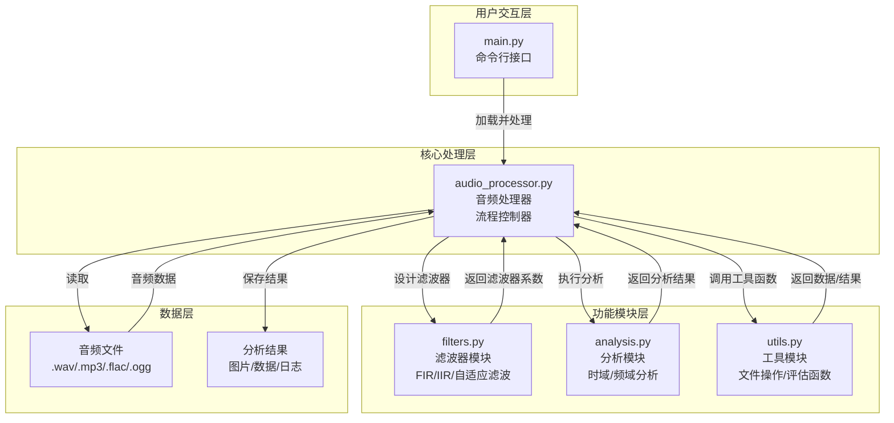
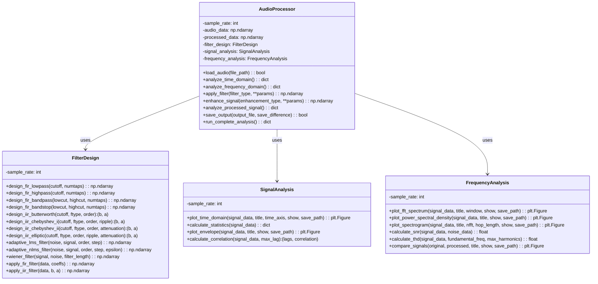
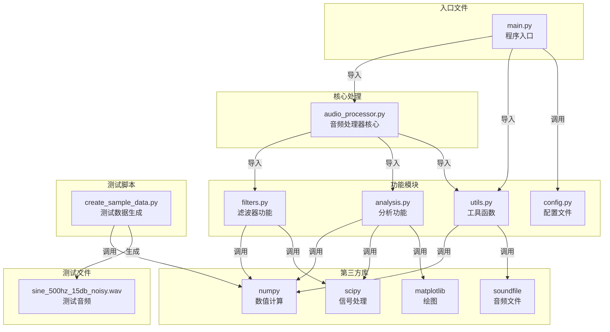

# DSP音频处理工程 - Mermaid图表

## 说明

本文档包含了工程中各个模块的功能链接和数据流的Mermaid图表，用于报告撰写。

---

## 1. 系统总体架构图



**说明**：展示了整个系统采用三层架构设计，包括用户交互层、核心处理层和功能模块层，以及数据层。

---

## 2. 数据处理流程图（自顶向下）

```mermaid
graph TD
    Start([开始]) --> Load[1. 加载音频<br/>load_audio()]
    Load --> TD[2. 时域分析<br/>analyze_time_domain()]
    TD --> Statistics[2.1 计算统计特性<br/>calculate_statistics()]
    TD --> PlotTD[2.2 绘制时域波形<br/>plot_time_domain()]
    TD --> Envelope[2.3 绘制包络<br/>plot_envelope()]
    TD --> Correlation[2.4 计算自相关<br/>calculate_correlation()]

    TD --> FD[3. 频域分析<br/>analyze_frequency_domain()]
    FD --> FFT[3.1 FFT频谱分析<br/>plot_fft_spectrum()]
    FD --> PSD[3.2 功率谱密度<br/>plot_power_spectral_density()]
    FD --> Spectrogram[3.3 频谱图<br/>plot_spectrogram()]
    FD --> SNR[3.4 计算信噪比<br/>calculate_snr()]

    FD --> Filter[4. 应用滤波器<br/>apply_filter()]
    Filter --> FilterDesign[4.1 设计滤波器<br/>FilterDesign类]
    FilterDesign --> FIR[4.1.1 FIR滤波器设计<br/>design_fir_lowpass()]
    FilterDesign --> IIR[4.1.2 IIR滤波器设计<br/>design_iir_butterworth()]
    FilterDesign --> Adaptive[4.1.3 自适应滤波<br/>adaptive_lms_filter()]
    Filter --> ApplyFIR[4.2 应用滤波器<br/>apply_fir_filter()]
    Filter --> ApplyIIR[4.3 应用IIR滤波<br/>apply_iir_filter()]

    Filter --> Enhance[5. 信号增强<br/>enhance_signal()]
    Enhance --> Normalize[5.1 归一化处理<br/>normalize_signal()]
    Enhance --> DynamicRange[5.2 动态范围压缩]

    Enhance --> Analyze[6. 分析处理结果<br/>analyze_processed_signal()]
    Analyze --> Compare[6.1 对比分析<br/>compare_signals()]
    Analyze --> Metrics[6.2 计算性能指标<br/>evaluate_noise_reduction()]

    Analyze --> Save[7. 保存结果<br/>save_output()]
    Save --> End([结束])
```

**说明**：展示了从音频加载到结果保存的完整信号处理流程，采用自顶向下的处理方式。

---

## 3. 核心模块类结构图



**说明**：展示了核心类的结构、属性和方法，以及它们之间的依赖关系。

---

## 4. 函数调用关系图

```mermaid
graph LR
    subgraph 主控制函数
        Main[main.py<br/>主函数]<br/>run_complete_analysis()<br/>AudioProcessor类方法
    end

    subgraph 数据处理函数
        Load[load_audio()]<br/>音频加载
        Normalize[normalize_signal()]<br/>信号归一化
        Save[save_audio()]<br/>音频保存
    end

    subgraph 时域分析函数
        TD1[plot_time_domain()]<br/>绘制波形
        TD2[calculate_statistics()]<br/>统计特性
        TD3[plot_envelope()]<br/>包络分析
        TD4[calculate_correlation()]<br/>自相关
    end

    subgraph 频域分析函数
        FD1[plot_fft_spectrum()]<br/>FFT频谱
        FD2[plot_power_spectral_density()]<br/>功率谱密度
        FD3[plot_spectrogram()]<br/>频谱图
        FD4[calculate_snr()]<br/>信噪比
        FD5[calculate_thd()]<br/>谐波失真
    end

    subgraph 滤波器设计函数
        Filter1[design_fir_lowpass()]<br/>FIR低通
        Filter2[design_fir_highpass()]<br/>FIR高通
        Filter3[design_fir_bandpass()]<br/>FIR带通
        Filter4[design_iir_butterworth()]<br/>IIR滤波
        Filter5[adaptive_lms_filter()]<br/>自适应滤波
        Filter6[wiener_filter()]<br/>维纳滤波
    end

    Main --> Load
    Main --> TD1
    Main --> TD2
    Main --> FD1
    Main --> FD2
    Main --> Filter1
    Main --> Normalize
    Main --> Save

    Filter1 --> Filter2
    Filter1 --> Filter3
    Filter1 --> Filter4
    Filter1 --> Filter5
    Filter1 --> Filter6

    FD1 --> FD2
    FD1 --> FD3
    FD1 --> FD4
    FD1 --> FD5

    TD1 --> TD2
    TD1 --> TD3
    TD1 --> TD4
```

**说明**：展示了主函数与各个功能函数之间的调用关系。

---

## 5. 滤波器设计流程图

```mermaid
graph TD
    Start([滤波器设计开始]) --> Input[输入滤波器类型<br/>FIR/IIR/自适应]

    Input --> FIR{FIR滤波器?}
    FIR -->|是| FIR_Params[输入参数<br/>cutoff_freq<br/>numtaps<br/>window]
    FIR_Params --> FIR_Design[调用 firwin()<br/>设计滤波器系数]
    FIR_Design --> FIR_Coeff[生成FIR系数<br/>np.ndarray]

    Input --> IIR{IIR滤波器?}
    IIR -->|是| IIR_Params[输入参数<br/>cutoff_freq<br/>order<br/>filter_type<br/>ripple/attenuation]
    IIR_Params --> IIR_Design[调用 iirfilter()<br/>设计滤波器系数]
    IIR_Design --> IIR_Coeff[生成IIR系数<br/>(b, a)数字]

    Input --> Adaptive{自适应滤波?}
    Adaptive -->|是| Adaptive_Params[输入参数<br/>filter_order<br/>step_size<br/>noise_reference]
    Adaptive_Params --> Adaptive_Design[调用滤波函数<br/>adaptive_lms_filter()]
    Adaptive_Design --> Adaptive_Coeff[生成自适应权重<br/>动态调整]

    FIR_Coeff --> Apply[应用滤波器<br/>卷积运算]
    IIR_Coeff --> Apply
    Adaptive_Coeff --> Apply

    Apply --> Output[输出滤波后信号]
    Output --> End([滤波器设计结束])
```

**说明**：展示了不同类型滤波器的设计流程和参数输入。

---

## 6. 数据流图（音频处理全流程）

```mermaid
flowchart LR
    subgraph 输入阶段
        direction LR
        I1[音频文件<br/>.wav/.mp3/.flac/.ogg]
        I2[命令行参数<br/>滤波器类型<br/>参数配置]
    end

    subgraph 加载阶段
        direction LR
        L1[读取音频文件<br/>load_audio()]
        L2[重采样<br/>44100 Hz]
        L3[格式转换<br/>numpy.ndarray]
    end

    subgraph 分析阶段
        direction LR
        A1[时域分析<br/>统计特性<br/>波形图]
        A2[频域分析<br/>FFT频谱<br/>功率谱密度<br/>频谱图]
    end

    subgraph 滤波阶段
        direction LR
        F1[滤波器设计<br/>FIR/IIR/自适应]
        F2[滤波器应用<br/>卷积运算]
        F3[信号处理<br/>降噪/增强]
    end

    subgraph 输出阶段
        direction LR
        O1[处理后音频<br/>保存到文件]
        O2[分析报告<br/>图片/数据/日志]
        O3[对比结果<br/>降噪前后对比]
    end

    I1 --> L1
    I2 --> F1
    L1 --> L2
    L2 --> L3
    L3 --> A1
    L3 --> A2
    A1 --> F1
    A2 --> F1
    F1 --> F2
    F2 --> F3
    F3 --> O1
    F3 --> O2
    F3 --> O3
```

**说明**：展示了数据在系统中的流动路径，从输入到输出的完整过程。

---

## 7. 文件依赖关系图



**说明**：展示了项目中各个文件之间的依赖关系，包括第三方库的使用。

---

## 使用说明

### 如何在报告中引用这些图表

1. **系统架构图**：用于说明整体系统设计和模块划分
2. **数据处理流程图**：用于描述音频处理的完整步骤
3. **类结构图**：用于展示面向对象设计
4. **函数调用关系图**：用于说明函数间的调用关系
5. **滤波器设计流程图**：用于详细说明滤波器设计过程
6. **数据流图**：用于说明数据在系统中的流动
7. **文件依赖关系图**：用于说明代码组织和依赖关系

### Mermaid渲染提示

- 需要在支持Mermaid的环境中查看（如Typora、VS Code插件、GitHub等）
- 或者在在线Mermaid编辑器中渲染：https://mermaid.live/
- 建议将代码块复制并保存为`.mmd`文件，然后使用工具打开

---

**文档版本**：1.0
**最后更新**：2025年
**用途**：DSP音频处理工程报告撰写
